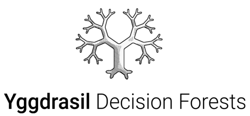

<p align="center">

</p>

**Yggdrasil Decision Forests** (YDF) is a production-grade collection of
algorithms for the training, serving, and interpretation of decision forest
models. YDF is open-sourced and available in Python, C++, CLI, in TensorFlow
under the name
[TensorFlow Decision Forests](https://github.com/tensorflow/decision-forests),
JavaScript (inference only), and Go (inference only).

To learn more about YDF, check
[the documentation 📕](https://ydf.readthedocs.org/).

For details about YDF design, read our KDD 2023 paper
[Yggdrasil Decision Forests: A Fast and Extensible Decision Forests Library](https://doi.org/10.1145/3580305.3599933).

## Features

-   Random Forest, Gradient Boosted Trees, CART, and variations such as Dart,
    Extremely randomized trees.
-   Classification, regression, ranking and uplifting.
-   Model evaluation e.g. accuracy, auc, roc, auuc, pr-auc, confidence
    boundaries, ndgc.
-   Model analysis e.g. pdp, cep, variable importance, model plotting, structure
    analysis.
-   Native support for numerical, categorical, boolean, categorical-set (e.g.
    text) features.
-   Native support for missing values.
-   State of the art tree learning features e.g. oblique split, honest tree,
    hessian score, global tree optimization.
-   Distributed training.
-   Automatic hyper-parameter tuning.
-   Fast model inference e.g. vpred, quick-scorer extended.
-   Cross compatible API and models: C++, CLI, Go, JavaScript and Python.

See the [feature list](https://ydf.readthedocs.io/en/latest/features.html) for
more details.

## Usage example

With the **CLI** you can train, evaluate, and benchmark the speed of a model as
follows:

```shell
# Download YDF.
wget https://github.com/google/yggdrasil-decision-forests/releases/download/1.0.0/cli_linux.zip
unzip cli_linux.zip

# Create a training configuration
echo 'label:"my_label" learner:"RANDOM_FOREST" ' > config.pbtxt

# List columns in training dataset
infer_dataspec --dataset="csv:train.csv" --output="spec.pbtxt"

# Train model
train --dataset="csv:train.csv" --dataspec="spec.pbtxt" --config="config.pbtxt" --output="my_model"

# Evaluate model
evaluate --dataset="csv:test.csv" --model="my_model" > evaluation.txt

# Benchmark the speed of the model
benchmark_inference --dataset="csv:test.csv" --model="my_model" > benchmark.txt
```

(based on [examples/beginner.sh](examples/beginner.sh))

The same model can be trained in C++ as follows:

```c++
auto dataset_path = "csv:train.csv";

// List columns in training dataset
DataSpecification spec;
CreateDataSpec(dataset_path, false, {}, &spec);

// Create a training configuration
TrainingConfig train_config;
train_config.set_learner("RANDOM_FOREST");
train_config.set_task(Task::CLASSIFICATION);
train_config.set_label("my_label");

// Train model
std::unique_ptr<AbstractLearner> learner;
GetLearner(train_config, &learner);
auto model = learner->Train(dataset_path, spec);

// Export model
SaveModel("my_model", model.get());
```

(based on [examples/beginner.cc](examples/beginner.cc))

The same model can be trained in Python using TensorFlow Decision Forests as
follows:

```python
import tensorflow_decision_forests as tfdf
import pandas as pd

# Load dataset in a Pandas dataframe.
train_df = pd.read_csv("project/train.csv")

# Convert dataset into a TensorFlow dataset.
train_ds = tfdf.keras.pd_dataframe_to_tf_dataset(train_df, label="my_label")

# Train model
model = tfdf.keras.RandomForestModel()
model.fit(train_ds)

# Export model.
model.save("project/model")
```

(see
[TensorFlow Decision Forests](https://github.com/tensorflow/decision-forests))

## Google I/O Presentation

Yggdrasil Decision Forests powers TensorFlow Decision Forests.

<div align="center">
    <a href="https://youtu.be/5qgk9QJ4rdQ">
        </img>
    </a>
</div>

## Documentation & Resources

The following resources are available:

-   [📕 Documentation](https://ydf.readthedocs.io/en/latest/)
-   [Issue tracker](https://github.com/google/yggdrasil-decision-forests/issues)
-   [Changelog](https://ydf.readthedocs.io/en/latest/ydf_changelog.html)
-   [TensorFlow Decision Forest](https://github.com/tensorflow/decision-forests)
-   [Long time support](https://ydf.readthedocs.io/en/latest/lts.html)

## Citation

If you us Yggdrasil Decision Forests in a scientific publication, please cite
the following paper:
[Yggdrasil Decision Forests: A Fast and Extensible Decision Forests Library](https://doi.org/10.1145/3580305.3599933).

**Bibtex**

```
@inproceedings{GBBSP23,
  author       = {Mathieu Guillame{-}Bert and
                  Sebastian Bruch and
                  Richard Stotz and
                  Jan Pfeifer},
  title        = {Yggdrasil Decision Forests: {A} Fast and Extensible Decision Forests
                  Library},
  booktitle    = {Proceedings of the 29th {ACM} {SIGKDD} Conference on Knowledge Discovery
                  and Data Mining, {KDD} 2023, Long Beach, CA, USA, August 6-10, 2023},
  pages        = {4068--4077},
  year         = {2023},
  url          = {https://doi.org/10.1145/3580305.3599933},
  doi          = {10.1145/3580305.3599933},
}
```

**Raw**

Yggdrasil Decision Forests: A Fast and Extensible Decision Forests Library,
Guillame-Bert et al., KDD 2023: 4068-4077. doi:10.1145/3580305.3599933

## Contact

You can contact the core development team at
[decision-forests-contact@google.com](mailto:decision-forests-contact@google.com).

## Credits

Yggdrasil Decision Forests and TensorFlow Decision Forests are developed by:

-   Mathieu Guillame-Bert (gbm AT google DOT com)
-   Jan Pfeifer (janpf AT google DOT com)
-   Sebastian Bruch (sebastian AT bruch DOT io)
-   Richard Stotz (richardstotz AT google DOT com)
-   Arvind Srinivasan (arvnd AT google DOT com)

## Contributing

Contributions to TensorFlow Decision Forests and Yggdrasil Decision Forests are
welcome. If you want to contribute, check the
[contribution guidelines](CONTRIBUTING.md).

## License

[Apache License 2.0](LICENSE)
