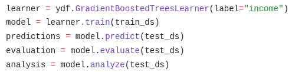
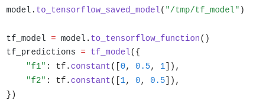
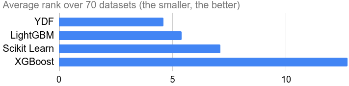
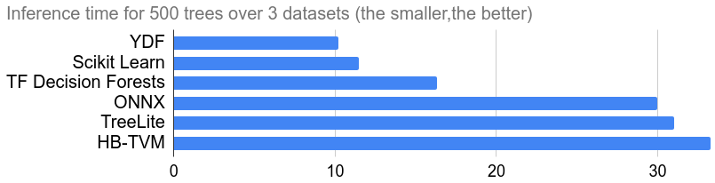

#

{: .center .logo}
<!-- {: .center .logo} -->

<div class="intro_text">
YDF is a library to train, evaluate, interpret, and
serve Random Forest,<br />Gradient Boosted Decision Trees, and CART decision forest
models.
</div>

<a class="getting_started_button" href="tutorial/getting_started"> Getting
Started 🧭 </a>

<div class="arguments">

<div class="argument">
<div class="column explanation">

<div class="reason">
<div class="title">A concise and modern API</div>

<div class="text">YDF allows for rapid prototyping and development while minimizing risk of modeling errors.</div>
</div>
</div>

<div class="column illustration">

</div>
</div>

<div class="argument">
<div class="column illustration">

</div>

<div class="column explanation">
    <div class="reason">
        <div class="title">Deep learning composition</div>
        <div class="text">Integrated with Jax, TensorFlow, and Keras.</div>
        </div>
    </div>
</div>

<div class="argument">
<div class="column explanation">

<div class="reason">
<div class="title">Cutting-edge algorithms</div>

<div class="text">Include the latest decision forest research to ensure maximum performance.</div>
</div>
</div>

<div class="column illustration">

<div class="label">
Source: <a href="https://doi.org/10.1145/3580305.3599933">Yggdrasil Decision Forests: A Fast and Extensible Decision Forests Library (KDD 2023)</a>.
</div>
</div>
</div>

<div class="argument">
<div class="column illustration">

<div class="label">
Source: <a href="https://doi.org/10.1145/3580305.3599933">A Comparison of Decision Forest Inference Platforms from A Database Perspective (Arxiv 2023)</a>.
</div>
</div>

<div class="column explanation">

<div class="reason">
<div class="title">Fast inference</div>

<div class="text">Compute predictions in a few microseconds. Executed in the tens of millions of times per second in Google.</div>
</div>
</div>
</div>

</div>

## Installation

To install YDF from [PyPI](https://pypi.org/project/ydf/), run:

```shell
pip install ydf -U
```

YDF is available on Python 3.8, 3.9, 3.10, 3.11 and 3.12, on Windows x86-64
Linux x86-64, and macOS ARM64.

## Usage example

[](https://colab.research.google.com/github/google/yggdrasil-decision-forests/blob/main/documentation/public/docs/tutorial/usage_example.ipynb)

```python
import ydf
import pandas as pd

# Load dataset with Pandas
ds_path = "https://raw.githubusercontent.com/google/yggdrasil-decision-forests/main/yggdrasil_decision_forests/test_data/dataset/"
train_ds = pd.read_csv(ds_path + "adult_train.csv")
test_ds = pd.read_csv(ds_path + "adult_test.csv")

# Train a Gradient Boosted Trees model
model = ydf.GradientBoostedTreesLearner(label="income").train(train_ds)

# Look at a model (input features, training logs, structure, etc.)
model.describe()

# Evaluate a model (e.g. roc, accuracy, confusion matrix, confidence intervals)
model.evaluate(test_ds)

# Generate predictions
model.predict(test_ds)

# Analyse a model (e.g. partial dependence plot, variable importance)
model.analyze(test_ds)

# Benchmark the inference speed of a model
model.benchmark(test_ds)

# Save the model
model.save("/tmp/my_model")
```

## Key features

**Modeling**

-   Train [Random Forest](py_api/RandomForestLearner.md),
    [Gradient Boosted Trees](py_api/GradientBoostedTreesLearner.md),
    [Cart](py_api/CartLearner.md), and
    [Isolation Forest](py_api/IsolationForestLearner.md) models.
-   Train [classification](tutorial/classification.ipynb),
    [regression](tutorial/regression.ipynb), [ranking](tutorial/ranking.ipynb),
    [uplifting](tutorial/uplifting.ipynb), and
    [anomaly detection](tutorial/anomaly_detection.ipynb) models.
-   [Plot of decision trees](tutorial/inspecting_trees.ipynb).
-   [Interpret model](tutorial/model_understanding.ipynb) (variable importances,
    partial dependence plots, conditional dependence plots).
-   Interpret predictions ([counter factual](tutorial/counterfactual.ipynb),
    [feature variation](tutorial/prediction_understanding.ipynb)).
-   [Evaluate models](tutorial/train_and_test.ipynb) (accuracy, AUC, ROC plots,
    RMSE, confidence intervals,
    [cross-validation](tutorial/cross_validation.ipynb)).
-   [Hyper-parameter tune models](tutorial/tuning.ipynb).
-   Consume natively [numerical](tutorial/numerical_feature.ipynb),
    [categorical](tutorial/categorical_feature.ipynb), boolean, tags, text, and
    missing values.
-   Consume natively [Pandas Dataframe](tutorial/pandas.ipynb), Numpy Arrays,
    [TensorFlow Datasets](tutorial/tf_dataset.ipynb), CSV files and TensorFlow
    Records.

**Serving**

-   [Benchmark](tutorial/getting_started/#benchmark-model-speed) model
    inference.
-   Run models in Python, [C++](tutorial/cpp.ipynb),
    [Go](https://github.com/google/yggdrasil-decision-forests/tree/main/yggdrasil_decision_forests/port/go),
    [JavaScript](https://github.com/google/yggdrasil-decision-forests/tree/main/yggdrasil_decision_forests/port/javascript),
    and [CLI](cli_commands.md).
-   Online inference with REST API with
    [TensorFlow Serving and Vertex AI](tutorial/tf_serving.ipynb).

**Advanced modeling**

-   Compose YDF models with Neural Network models in
    [TensorFlow, Keras](tutorial/compose_with_tf.ipynb), and
    [JAX](tutorial/compose_with_jax.ipynb).
-   [Distributed training](tutorial/distributed_training.ipynb) over billions of
    examples and hundreds of machines.
-   Use cutting-edge learning algorithm such as oblique splits, honest trees,
    hessian scores, global tree optimizations, optimal categorical splits,
    categorical-set inputs, dart, extremely randomized trees.
-   Apply [monotonic constraints](tutorial/monotonic_feature.ipynb).
-   Consumes [multi-dimensional](tutorial/multidimensional_feature.ipynb)
    features.
-   Enjoy backward compatibility for model and learners since 2018.
-   [Edits trees](tutorial/editing_trees.ipynb) in Python.
-   Define [custom loss](tutorial/custom_loss.ipynb) in Python.

## Next steps

Read the [🧭 Getting Started tutorial](tutorial/getting_started.ipynb). You will
learn how to train a model, interpret it, evaluate it, generate predictions,
benchmark its speed, and export it for serving.

Ask us questions on
[Github](https://github.com/google/yggdrasil-decision-forests). Googlers can
join the [internal YDF Chat](http://go/ydf-chat).

Read the [TF-DF to YDF Migration guide](tutorial/migrating_to_ydf.ipynb) to
convert a TensorFlow Decision Forests pipeline into a YDF pipeline.
