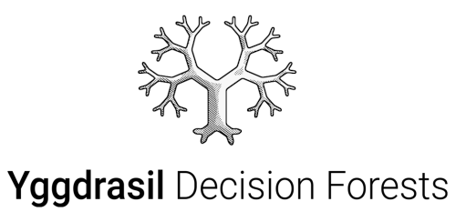

#

{: .center}

**Yggdrasil Decision Forests** (YDF) is a production-grade collection of
algorithms developed in Google Switzerland 🏔️ since 2018 for the training,
serving, and interpretation of decision forest models. YDF is available in
Python, C++, CLI, in TensorFlow under the name
[TensorFlow Decision Forests](https://github.com/tensorflow/decision-forests),
JavaScript (inference only), and Go (inference only).

!!! note "Why YDF?"

    [Decision Forests](https://developers.google.com/machine-learning/decision-forests) are easy to develop, show
    excellent performance both with and without hyperparameter tuning on a variety
    of problems, and are fast to train and run. Yggdrasil Decision Forests 🌳 aims to
    streamline the process of model development 🛠 to production 🚀 by providing a
    simple, error-proof API 🩹, automated best practices 📘, and a variety of serving
    options compatible with Google tools.

For more information on the design of YDF, please see our paper in KDD 2023:
[Yggdrasil Decision Forests: A Fast and Extensible Decision Forests Library](https://doi.org/10.1145/3580305.3599933).

## Key features

-   A simple API for training, evaluation and serving of decision forests
    models.
-   Supports Random Forest, Gradient Boosted Trees and Carts, and advanced
    learning algorithm such as oblique splits, honest trees, hessian and
    non-hessian scores, and global tree optimizations.
-   Train classification, regression, ranking, and uplifting models.
-   Fast model inference in cpu (microseconds / example / cpu-core).
-   Supports distributed training over billions of examples.
-   Serving in Python, C++, TensorFlow Serving, Go, JavaScript, and CLI.
-   Rich report for model description (e.g., training logs, plot trees),
    analysis (e.g., variable importances, partial dependence plots, conditional
    dependence plots), evaluation (e.g., accuracy, AUC, ROC plots, RMSE,
    confidence intervals), tuning (trials configuration and scores), and
    cross-validation.
-   Natively consumes numerical, categorical, boolean, text, and missing values.
-   Backward compatibility for model and learners since 2018.
-   Consumes Pandas Dataframes, Numpy arrays, TensorFlow Dataset and CSV files.

## Installation

To install YDF in Python from [PyPi](https://pypi.org/project/ydf/), run:

```shell
pip install ydf
```

## Usage example

```python
import ydf
import pandas as pd

train_ds = pd.read_csv("adult_train.csv")
test_ds = pd.read_csv("adult_test.csv")

# Train a model
model = ydf.GradientBoostedTreesLearner(label="income").train(train_ds)

# Look at a model (input features, training logs, structure, etc.)
model.describe()

# Evaluate a model (e.g. roc, accuracy, confusion matrix, confidence intervals)
model.evaluate(test_ds)

# Generate predictions
model.predict(test_ds)

# Analyse a model (e.g. partial dependence plot, variable importance)
model.analyze(test_ds)

# Benchmark the inference speed of a model
model.benchmark(test_ds)

# Save the model
model.save("/tmp/my_model")
```

## Next steps

Check the
[Getting Started tutorial 🧭](tutorial/getting_started.ipynb).
Then, explore the other tutorials on the left depending on your interests. For
example, if you are going to rank things, check the
[ranking](tutorial/ranking.ipynb) tutorial.

## License

[Apache License 2.0](LICENSE)
