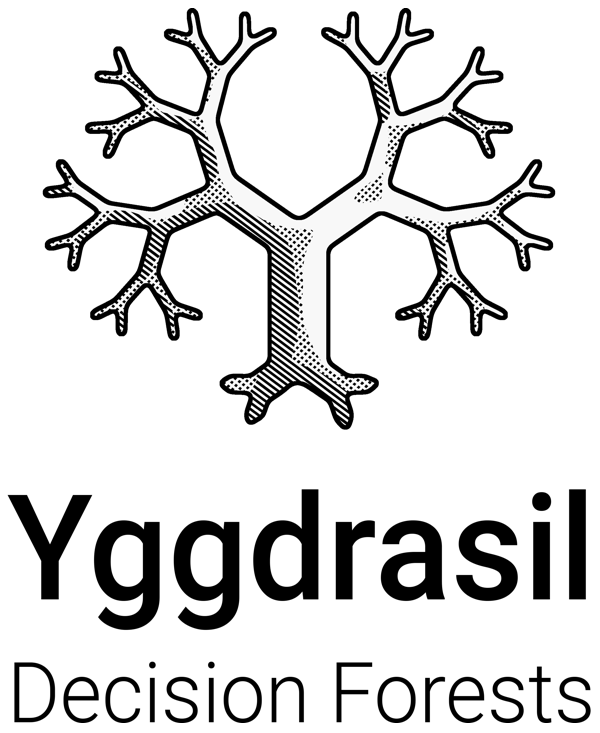

#

{: .center .logo}

**Yggdrasil Decision Forests** (**YDF**) is a library to train, evaluate,
interpret, and productionize decision forest models such as Random Forest and
Gradient Boosted Decision Trees. YDF is available in Python, C++, CLI,
JavaScript and Go. YDF is developed by and used by Google since 2018. YDF powers
the
[TensorFlow Decision Forests](https://github.com/tensorflow/decision-forests)
library.

**New to decision forests?**

Decision Forests are machine learning models which are easy to train and show
excellent performance on tabular data. For more information on how decision
forests work, see the
[Decision Forests Google Machine Learning class](https://developers.google.com/machine-learning/decision-forests).

**Why Yggdrasil Decision Forests?**

YDF shines by its concise and modern API that relies on rich default logic and
values to help users avoid modeling mistakes. It also features a tight
integration with other ML tools such as Pandas, Numpy or TensorFlow, and
implements the latest research in decision forest technology, giving its users
access to state-of-the-art results. For more information about YDF's API design
and a performance comparison with other decision forest libraries, see our paper
in KDD 2023:
[Yggdrasil Decision Forests: A Fast and Extensible Decision Forests Library](https://doi.org/10.1145/3580305.3599933).

## Key features

-   A simple API for training, evaluation and serving of decision forests
    models.
-   Supports Random Forest, Gradient Boosted Trees and Carts, and advanced
    learning algorithm such as oblique splits, honest trees, hessian and
    non-hessian scores, and global tree optimizations.
-   Train classification, regression, ranking, and uplifting models.
-   Fast model inference in cpu (microseconds / example / cpu-core).
-   Supports distributed training over billions of examples.
-   Serving in Python, C++, TensorFlow Serving, Go, JavaScript, and CLI.
-   Rich report for model description (e.g., training logs, plot trees),
    analysis (e.g., variable importances, partial dependence plots, conditional
    dependence plots), evaluation (e.g., accuracy, AUC, ROC plots, RMSE,
    confidence intervals), tuning (trials configuration and scores), and
    cross-validation.
-   Natively consumes numerical, categorical, boolean, text, and missing values.
-   Backward compatibility for model and learners since 2018.
-   Consumes Pandas Dataframes, Numpy arrays, TensorFlow Dataset and CSV files.

## Installation

To install YDF in Python from [PyPi](https://pypi.org/project/ydf/), run:

```shell
pip install ydf
```

## Usage example

```python
import ydf
import pandas as pd

train_ds = pd.read_csv("adult_train.csv")
test_ds = pd.read_csv("adult_test.csv")

# Train a model
model = ydf.GradientBoostedTreesLearner(label="income").train(train_ds)

# Look at a model (input features, training logs, structure, etc.)
model.describe()

# Evaluate a model (e.g. roc, accuracy, confusion matrix, confidence intervals)
model.evaluate(test_ds)

# Generate predictions
model.predict(test_ds)

# Analyse a model (e.g. partial dependence plot, variable importance)
model.analyze(test_ds)

# Benchmark the inference speed of a model
model.benchmark(test_ds)

# Save the model
model.save("/tmp/my_model")
```

## Next steps

Check the [Getting Started tutorial 🧭](tutorial/getting_started.ipynb). Then,
explore the other tutorials on the left depending on your interests. For
example, if you are going to rank things, check the
[ranking](tutorial/ranking.ipynb) tutorial. Users coming from TensorFlow
Forests should check out the [migration guide](tutorial/migrating_to_ydf.ipynb).

## License

[Apache License 2.0](LICENSE)
