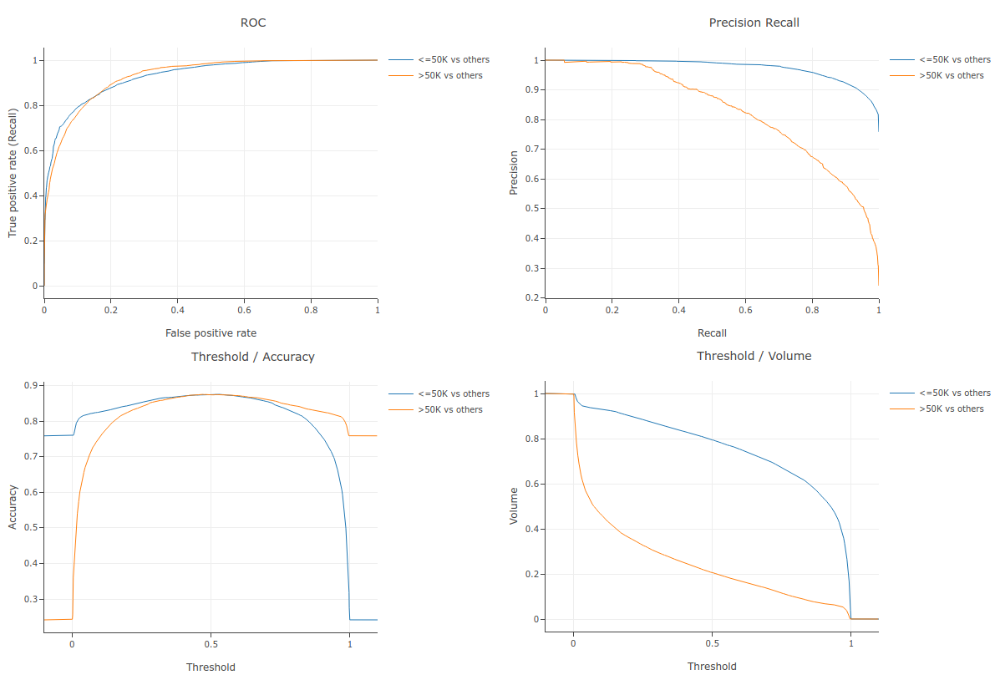

# Quick Start with the CLI API

``` {note}
This page is the *Quick Start* for the *CLI API*.
See the [list of available training APIs](apis) for other available APIs.
```

On this page, we train, evaluate, analyze, generate predictions, and measure the
inference speed of a binary classification model using the CLI API.

``` {note}
An end-to-end example of the CLI API is available [here](https://github.com/google/yggdrasil-decision-forests/blob/main/examples/beginner.sh).
```

## Install YDF CLI

The latest CLI release of YDF is available on the
[Github release page](https://github.com/google/yggdrasil-decision-forests/releases).

```shell
# Download and extract the last CLI release of YDF.
wget https://github.com/google/yggdrasil-decision-forests/releases/download/1.0.0/cli_linux.zip
unzip cli_linux.zip
```

Each binary in the release archive executes a different task. For example, the
`train` command trains a model. Each command is explained in the
[cli.txt](cli_commands) file available in the archive, or using the `--help`
flag. For example:

```shell
# Print the help of the 'train' command.
./train --help
```

## Download dataset

For this example, we use the
[UCI Adult](https://archive.ics.uci.edu/ml/datasets/adult) dataset. First, we
download a copy of the dataset:

```shell
DATASET_SRC=https://raw.githubusercontent.com/google/yggdrasil-decision-forests/main/yggdrasil_decision_forests/test_data/dataset
wget -q ${DATASET_SRC}/adult_train.csv -O adult_train.csv
wget -q ${DATASET_SRC}/adult_test.csv -O adult_test.csv
```

```shell
# Display the first 3 examples
head -n 4 adult_train.csv
```

Result:

```text
age,workclass,fnlwgt,education,education_num,marital_status,occupation,relationship,race,sex,capital_gain,capital_loss,hours_per_week,native_country,income
44,Private,228057,7th-8th,4,Married-civ-spouse,Machine-op-inspct,Wife,White,Female,0,0,40,Dominican-Republic,<=50K
20,Private,299047,Some-college,10,Never-married,Other-service,Not-in-family,White,Female,0,0,20,United-States,<=50K
40,Private,342164,HS-grad,9,Separated,Adm-clerical,Unmarried,White,Female,0,0,37,United-States,<=50K
```

This dataset is stored in two CSV files containing respectively the training and
testing examples. YDF supports csv files directly.

``` {note}
When passing a dataset path to a command, the format of the dataset is always specified using a prefix.
For example, the prefix `csv:` in the path `csv:/path/to/my/file` indicates that the file is a csv file.
See [here](https://github.com/google/yggdrasil-decision-forests/blob/main/documentation/user_manual.md#dataset-path-and-format) for the list of supported dataset formats.
```

## Create dataspec

In this dataset, input features are either numerical (e.g. `age`) or categorical
(e.g., `education`). Some examples have missing values. YDF detects
automatically the semantics of the features (e.g., numerical, categorical) and
handles missing values natively. The *dataspec* (short for *dataset
specification*) is a file that contains the name, type and meta-dataset of the
columns in a dataset. The dataspec is created automatically with the
`infer_dataspec` command.

```shell
# Create the dataspec
./infer_dataspec --dataset=csv:adult_train.csv --output=dataspec.pbtxt
```

The dataspec file `dataspec.pbtxt` can be printed using the `show_dataspec`
command:

```shell
# Display the dataspec
./show_dataspec --dataspec=dataspec.pbtxt
```

The result is:

```text
Number of records: 22792
Number of columns: 15

Number of columns by type:
    CATEGORICAL: 9 (60%)
    NUMERICAL: 6 (40%)

Columns:

CATEGORICAL: 9 (60%)
    3: "education" CATEGORICAL has-dict vocab-size:17 zero-ood-items most-frequent:"HS-grad" 7340 (32.2043%)
    14: "income" CATEGORICAL has-dict vocab-size:3 zero-ood-items most-frequent:"<=50K" 17308 (75.9389%)
    5: "marital_status" CATEGORICAL has-dict vocab-size:8 zero-ood-items most-frequent:"Married-civ-spouse" 10431 (45.7661%)
    13: "native_country" CATEGORICAL num-nas:407 (1.78571%) has-dict vocab-size:41 num-oods:1 (0.00446728%) most-frequent:"United-States" 20436 (91.2933%)
    6: "occupation" CATEGORICAL num-nas:1260 (5.52826%) has-dict vocab-size:14 num-oods:1 (0.00464425%) most-frequent:"Prof-specialty" 2870 (13.329%)
    8: "race" CATEGORICAL has-dict vocab-size:6 zero-ood-items most-frequent:"White" 19467 (85.4115%)
    7: "relationship" CATEGORICAL has-dict vocab-size:7 zero-ood-items most-frequent:"Husband" 9191 (40.3256%)
    9: "sex" CATEGORICAL has-dict vocab-size:3 zero-ood-items most-frequent:"Male" 15165 (66.5365%)
    1: "workclass" CATEGORICAL num-nas:1257 (5.51509%) has-dict vocab-size:8 num-oods:1 (0.0046436%) most-frequent:"Private" 15879 (73.7358%)

NUMERICAL: 6 (40%)
    0: "age" NUMERICAL mean:38.6153 min:17 max:90 sd:13.661
    10: "capital_gain" NUMERICAL mean:1081.9 min:0 max:99999 sd:7509.48
    11: "capital_loss" NUMERICAL mean:87.2806 min:0 max:4356 sd:403.01
    4: "education_num" NUMERICAL mean:10.0927 min:1 max:16 sd:2.56427
    2: "fnlwgt" NUMERICAL mean:189879 min:12285 max:1.4847e+06 sd:106423
    12: "hours_per_week" NUMERICAL mean:40.3955 min:1 max:99 sd:12.249

Terminology:
    nas: Number of non-available (i.e. missing) values.
    ood: Out of dictionary.
    manually-defined: Attribute which type is manually defined by the user i.e. the type was not automatically inferred.
    tokenized: The attribute value is obtained through tokenization.
    has-dict: The attribute is attached to a string dictionary e.g. a categorical attribute stored as a string.
    vocab-size: Number of unique values.
```

The dataspec shows important information about the dataset. It important to
check that the dataset looks as expected before continuing with the modeling.

In this example, the dataset contains 22'792 examples and 15 columns. There are
9 categorical and 6 numerical columns (we call this the *semantics* of the
column. `education` is a categorical column with 17 unique possible values. The
most frequent of those values is `HS-grad` (32% of all values).

## (Optional) Create dataspec with a guide

In his example, the semantics of the columns were correctly detected. However,
when value representation is ambiguous, this might not be the
case. For example, the semantic of *enum* values (i.e., categorical values
represented as an integer) cannot be detected automatically in a .csv file.

In such a case, we would re-run the `infer_dataspec` command with an extra flag
to indicate the real semantic of the miss-detected column. For example, to force
`age` to be detected as a numerical column, we would run:

```shell
# Force the detection of 'age' as numerical.
cat <<EOF > guide.pbtxt
column_guides {
    column_name_pattern: "^age$"
    type: NUMERICAL
}
EOF

./infer_dataspec --dataset=csv:adult_train.csv --guide=guide.pbtxt --output=dataspec.pbtxt
```

## Train model

The model is trained with the `train` command. The hyper-parameters and other
configurations for the model training (e.g. label, features) are specified in a
*training configuration* file.

```shell
# Create a training configuration file
cat <<EOF > train_config.pbtxt
task: CLASSIFICATION
label: "income"
learner: "GRADIENT_BOOSTED_TREES"
# Change learner-specific hyper-parameters.
[yggdrasil_decision_forests.model.gradient_boosted_trees.proto.gradient_boosted_trees_config] {
  num_trees: 500
}
EOF

# Train the model
./train \
  --dataset=csv:adult_train.csv \
  --dataspec=dataspec.pbtxt \
  --config=train_config.pbtxt \
  --output=model
```

Results:

```text
[INFO train.cc:96] Start training model.
[INFO abstract_learner.cc:119] No input feature specified. Using all the available input features as input signal.
[INFO abstract_learner.cc:133] The label "income" was removed from the input feature set.
[INFO vertical_dataset_io.cc:74] 100 examples scanned.
[INFO vertical_dataset_io.cc:80] 22792 examples read. Memory: usage:1MB allocated:1MB. 0 (0%) examples have been skipped.
[INFO abstract_learner.cc:119] No input feature specified. Using all the available input features as input signal.
[INFO abstract_learner.cc:133] The label "income" was removed from the input feature set.
[INFO gradient_boosted_trees.cc:405] Default loss set to BINOMIAL_LOG_LIKELIHOOD
[INFO gradient_boosted_trees.cc:1008] Training gradient boosted tree on 22792 example(s) and 14 feature(s).
[INFO gradient_boosted_trees.cc:1051] 20533 examples used for training and 2259 examples used for validation
[INFO gradient_boosted_trees.cc:1434]   num-trees:1 train-loss:1.015975 train-accuracy:0.761895 valid-loss:1.071430 valid-accuracy:0.736609
[INFO gradient_boosted_trees.cc:1436]   num-trees:2 train-loss:0.955303 train-accuracy:0.761895 valid-loss:1.007908 valid-accuracy:0.736609
[INFO gradient_boosted_trees.cc:2871] Early stop of the training because the validation loss does not decrease anymore. Best valid-loss: 0.579583
[INFO gradient_boosted_trees.cc:230] Truncates the model to 136 tree(s) i.e. 136  iteration(s).
[INFO gradient_boosted_trees.cc:264] Final model num-trees:136 valid-loss:0.579583 valid-accuracy:0.870297
```

A few remarks:

-   Input features were not specified. Therefore, all the columns are used as
    input features except for the label.

-   DFs natively consume numerical, categorical, categorical-set features and
    missing values. Numerical features do not need to be normalized. Categorical
    string values do not need to be encoded in a dictionary.

-   Except for the `num_trees`, no training hyper-parameter is specified. The
    default values of all hyper-parameters are set such that they provide
    reasonable results in most situations. We will discuss alternative default
    values (called *hyper-parameter templates*) and automated tuning
    hyper-parameters later. The list of all hyper-parameters and their default
    value is available in the [hyper-parameters page)(hyper_parameters).

-   No validation dataset was provided for the training. Not all learners
    require a validation dataset. In this example, the `GRADIENT_BOOSTED_TREES`
    learner requires a validation dataset if early stopping is enabled (which is
    the case by default). In this case, 10% of the training dataset is used for
    validation. This rate can be changed using the `validation_ratio` parameter.
    Alternatively, the validation dataset can be provided with the
    `--valid_dataset` flag. The final model contains 136 trees for a validation
    accuracy of ~0.8702.

## Show model information

Information about the model can be shown using the `show_model` command.

```shell
# Show information about the model.
./show_model --model=model
```

Sample of the result:

```text
Type: "GRADIENT_BOOSTED_TREES"
Task: CLASSIFICATION
Label: "income"

Input Features (14):
    age
    workclass
    fnlwgt
    education
    education_num
    marital_status
    occupation
    relationship
    race
    sex
    capital_gain
    capital_loss
    hours_per_week
    native_country

No weights

Variable Importance: MEAN_MIN_DEPTH:
    1.         "income"  4.868164 ################
    2.            "sex"  4.625136 #############
    3.           "race"  4.590606 #############
    ...
   13.     "occupation"  3.640103 ####
   14. "marital_status"  3.626898 ###
   15.            "age"  3.219872

Variable Importance: NUM_AS_ROOT:
    1.            "age" 28.000000 ################
    2. "marital_status" 22.000000 ############
    3.   "capital_gain" 19.000000 ##########
    ...
   11.  "education_num"  3.000000
   12.     "occupation"  2.000000
   13. "native_country"  2.000000

Variable Importance: NUM_NODES:
    1.     "occupation" 516.000000 ################
    2.            "age" 431.000000 #############
    3.      "education" 424.000000 ############
    ...
   12.  "education_num" 73.000000 #
   13.            "sex" 39.000000
   14.           "race" 26.000000

Variable Importance: SUM_SCORE:
    1.   "relationship" 3103.387636 ################
    2.   "capital_gain" 2041.557944 ##########
    3.      "education" 1090.544247 #####
    ...
   12.      "workclass" 176.876787
   13.            "sex" 49.287215
   14.           "race" 13.923084


Loss: BINOMIAL_LOG_LIKELIHOOD
Validation loss value: 0.579583
Number of trees per iteration: 1
Node format: BLOB_SEQUENCE
Number of trees: 136
Total number of nodes: 7384

Number of nodes by tree:
Count: 136 Average: 54.2941 StdDev: 5.7779
Min: 33 Max: 63 Ignored: 0
----------------------------------------------
[ 33, 34)  2   1.47%   1.47% #
...
[ 60, 62) 16  11.76%  96.32% ########
[ 62, 63]  5   3.68% 100.00% ##

Depth by leafs:
Count: 3760 Average: 4.87739 StdDev: 0.412078
Min: 2 Max: 5 Ignored: 0
----------------------------------------------
[ 2, 3)   14   0.37%   0.37%
[ 3, 4)   75   1.99%   2.37%
[ 4, 5)  269   7.15%   9.52% #
[ 5, 5] 3402  90.48% 100.00% ##########

Number of training obs by leaf:
Count: 3760 Average: 742.683 StdDev: 2419.64
Min: 5 Max: 19713 Ignored: 0
----------------------------------------------
[     5,   990) 3270  86.97%  86.97% ##########
[   990,  1975)  163   4.34%  91.30%
...
[ 17743, 18728)   10   0.27%  99.55%
[ 18728, 19713]   17   0.45% 100.00%

Attribute in nodes:
    516 : occupation [CATEGORICAL]
    431 : age [NUMERICAL]
    424 : education [CATEGORICAL]
    420 : fnlwgt [NUMERICAL]
    297 : capital_gain [NUMERICAL]
    291 : hours_per_week [NUMERICAL]
    266 : capital_loss [NUMERICAL]
    245 : native_country [CATEGORICAL]
    224 : relationship [CATEGORICAL]
    206 : workclass [CATEGORICAL]
    166 : marital_status [CATEGORICAL]
    73 : education_num [NUMERICAL]
    39 : sex [CATEGORICAL]
    26 : race [CATEGORICAL]

Attribute in nodes with depth <= 0:
    28 : age [NUMERICAL]
    22 : marital_status [CATEGORICAL]
    19 : capital_gain [NUMERICAL]
    12 : capital_loss [NUMERICAL]
    11 : hours_per_week [NUMERICAL]
    11 : fnlwgt [NUMERICAL]
    8 : relationship [CATEGORICAL]
    8 : education [CATEGORICAL]
    6 : race [CATEGORICAL]
    4 : sex [CATEGORICAL]
    3 : education_num [NUMERICAL]
    2 : native_country [CATEGORICAL]
    2 : occupation [CATEGORICAL]

...

Condition type in nodes:
    1844 : ContainsBitmapCondition
    1778 : HigherCondition
    2 : ContainsCondition
Condition type in nodes with depth <= 0:
    84 : HigherCondition
    52 : ContainsBitmapCondition
Condition type in nodes with depth <= 1:
    243 : HigherCondition
    165 : ContainsBitmapCondition
...
```

``` {note}
The structure of the tree of the model can be printed using the `--full_definition` flag.
```

## Evaluate model

Next, we evaluate the model on the testing dataset using the `evaluate` command.
The evaluation result can be exported to a text file (`--format=text`; default)
or to an Html file with plots (`--format=html`). Html can be open with your web
browser.

```shell
# Evaluate the model and print the result in the console.
./evaluate --dataset=csv:adult_test.csv --model=model
```

Results

```text
Evaluation:
Number of predictions (without weights): 9769
Number of predictions (with weights): 9769
Task: CLASSIFICATION
Label: income

Accuracy: 0.874399  CI95[W][0.86875 0.879882]
LogLoss: 0.27768
ErrorRate: 0.125601

Default Accuracy: 0.758727
Default LogLoss: 0.552543
Default ErrorRate: 0.241273

Confusion Table:
truth\prediction
       <OOD>  <=50K  >50K
<OOD>      0      0     0
<=50K      0   6971   441
 >50K      0    786  1571
Total: 9769

One vs other classes:
  "<=50K" vs. the others
    auc: 0.929207  CI95[H][0.924358 0.934056] CI95[B][0.924076 0.934662]
    p/r-auc: 0.975657  CI95[L][0.971891 0.97893] CI95[B][0.973397 0.977947]
    ap: 0.975656   CI95[B][0.973393 0.977944]

  ">50K" vs. the others
    auc: 0.929207  CI95[H][0.921866 0.936549] CI95[B][0.923642 0.934566]
    p/r-auc: 0.830708  CI95[L][0.815025 0.845313] CI95[B][0.817588 0.843956]
    ap: 0.830674   CI95[B][0.817513 0.843892]
```

Interpretation:

-   The test dataset contains 9769 examples.
-   The test accuracy is 0.874399 with 95% confidence interval boundaries of
    [0.86875; 0.879882].
-   The test AUC is 0.929207 with 95% confidence interval boundaries of
    [0.924358 0.934056](when computed with a closed form) and [0.973397
    0.977947] when computed with bootstrapping.
-   The PR-AUC and AP metrics are also available.

The next command evaluates the model and exports the evaluation report to an
Html file.

```shell
# Evaluate the model and print the result in an Html file.
./evaluate --dataset=csv:adult_test.csv --model=model --format=html > evaluation.html
```



## Generate predictions

Exporting the predictions of a model can be useful for further analysis. The
`predict` command exports the predictions of a model to a file.

```shell
# Exports the prediction of the model to a csv file
./predict --dataset=csv:adult_test.csv --model=model --output=csv:predictions.csv

# Show the predictions for the first 3 examples
head -n 4 predictions.csv
```

Results:

```text
<=50K,>50K
0.978384,0.0216162
0.641894,0.358106
0.180569,0.819431
```

## Benchmark model inference speed

In time-critical applications, the speed of inference of a model can be
important. The `benchmark_inference` command measures the inference speed of the
model.

``` {note}
YDF has multiple algorithms to compute the predictions of a model.
Those inference algorithms differ in speed and coverage. When generating
predictions (e.g. `predict` command, or when using the C++ API) YDF
automatically uses the fastest algorithm available.

For comparison, the `benchmark_inference` shows the speed of all the available
algorithms.
```

``` {note}
Unless specified, inference algorithms are single-threaded.
It is up to the user to parallelize the model inference using multi-threading.
```

```shell
# Benchmark the inference speed of the model
./benchmark_inference --dataset=csv:adult_test.csv --model=model
```

Results:

```text
batch_size : 100  num_runs : 20
time/example(us)  time/batch(us)  method
----------------------------------------
            0.89              89  GradientBoostedTreesQuickScorerExtended [virtual interface]
          5.8475          584.75  GradientBoostedTreesGeneric [virtual interface]
          12.485          1248.5  Generic slow engine
----------------------------------------
```

We see that the model can run a 0.89 µs (micro-seconds) per example on average.
