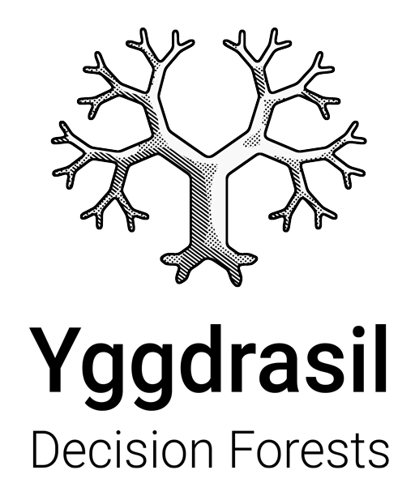
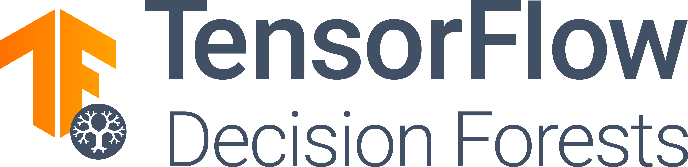

|

**Yggdrasil Decision Forests** (YDF) is a production grade collection of algorithms,
developed and used by Google, for the training, serving, and interpretation of Decision Forest
models. YDF is open-source and is available in C++, CLI (command-line-interface),
TensorFlow (under the name TensorFlow Decision Forests;TF-DF), Javascript, and Go
(inference only). See the :doc:`features` page for the list of features. Read
`Yggdrasil Decision Forests's paper <https://arxiv.org/abs/2212.02934>` for
details about YDF's design.

|

|

**TensorFlow Decision Forests** (TF-DF) is the official port of YDF to
TensorFlow using the `Keras API <https://keras.io/>`_. TF-DF makes it easy to train
and use decision forests in the TensorFlow ecosystem.

Content
=======

.. toctree::
  :maxdepth: 1

  intro_df

.. toctree::
  :maxdepth: 1
  :caption: CLI API

  Quick start <cli_quick_start>
  Installation <cli_install>
  cli_commands
  User manual <cli_user_manual>

.. toctree::
  :maxdepth: 1
  :caption: C++ API

  Example <https://github.com/google/yggdrasil-decision-forests/tree/main/examples/standalone>

.. toctree::
  :maxdepth: 1
  :caption: TF-DF / Python API

  Quick Start <https://www.tensorflow.org/decision_forests/tutorials/beginner_colab>
  Installation <https://www.tensorflow.org/decision_forests/installation>
  Tutorials <https://www.tensorflow.org/decision_forests/tutorials>

.. toctree::
  :maxdepth: 1
  :caption: Reference

  apis
  improve_model
  hyper_parameters
  metrics
  What are decision forests <https://developers.google.com/machine-learning/decision-forests>
  features
  lts

.. toctree::
  :maxdepth: 1
  :caption: Deploy a model

  serving_apis
  C++ <cpp_serving>
  Go <go_serving>
  JavaScript/Wasm <js_serving>
  TF Serving <tf_serving>
  Python <https://www.tensorflow.org/decision_forests/tutorials/predict_colab>
  Benchmark <benchmark_inference>
  convert_model

.. toctree::
  :maxdepth: 1
  :caption: Resources

  ydf_changelog
  YDF on Github <https://github.com/google/yggdrasil-decision-forests>
  TF-DF on Github <https://github.com/tensorflow/decision-forests>
  TF-DF on tf.org <https://www.tensorflow.org/decision_forests>
  contributing
  credit
